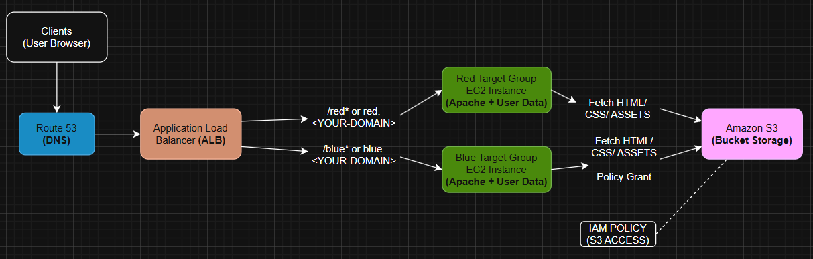

# AWS Load Balancer – Red/Blue Deployment

This project demonstrates how to design and deploy a **scalable, load-balanced web application** using AWS services such as **EC2, S3, ALB, IAM, and Route 53**.  
It showcases **advanced request routing** with an Application Load Balancer (ALB), serving different versions of a site (`Red` and `Blue`) based on **paths** or **hostnames**.

---

## 🏗️ Architecture Overview

- **Amazon S3** – stores static assets (HTML, CSS, images).
- **Amazon EC2** – hosts two instances (Red and Blue), each bootstrapped with user-data scripts.
- **Application Load Balancer (ALB)** – handles traffic distribution with:
  - Path-based routing: `/red*`, `/blue*`
  - Host-based routing: `red.<YOUR-DOMAIN>`, `blue.<YOUR-DOMAIN>`
- **IAM** – bucket policy to allow EC2 instances to fetch S3 objects.
- **Route 53** – DNS setup to map domain/subdomains to the ALB.



---

## 📂 Repository Structure

```text
AWS-Load-Balancer/
├── user-data/
│   ├── user-data-red.sh
│   └── user-data-blue.sh
├── iam/
│   └── bucket-permissions.json
├── s3/
│   ├── red-index.html
│   ├── blue-index.html
│   ├── hw-red.css
│   └── hw-blue.css
├── assets/
│   ├── architecture-diagram.png
│   ├── diagram-path-based.png
│   ├── diagram-host-based.png
│   ├── alb-listener-rules.png
│   ├── route53-records.png
│   └── s3-bucket-contents.png
├── .gitignore
├── LICENSE
└── README.md
```

## ⚙️ Setup Instructions

### 1. Upload files to S3
- Create a bucket:  
<YOUR-BUCKET-NAME> ``` - Upload files from `/s3`.

### 2. IAM bucket policy
- Use iam/bucket-permissions.json, replacing with your bucket ARN:

"Resource": [
  "arn:aws:s3:::<YOUR-BUCKET-NAME>",
  "arn:aws:s3:::<YOUR-BUCKET-NAME>/*"
]

### 3. Launch EC2 Instances
- Launch two Amazon Linux 2 instances.

- Attach the user data scripts during launch:

user-data-red.sh → Red target group

user-data-blue.sh → Blue target group

### 4. Configure Target Groups
- Create Red and Blue target groups in your ALB.

- Register the respective EC2 instances.

- Health check paths:

Red → /red/index.html

Blue → /blue/index.html

### 5. Create Application Load Balancer
- Listener: HTTP :80

- Add routing rules:

Path-based → /red* → Red TG, /blue* → Blue TG

Host-based → red.<YOUR-DOMAIN> → Red TG, blue.<YOUR-DOMAIN> → Blue TG

- Default rule: return a fixed 404 (optional)

### 6. Route 53 DNS Setup
- Create hosted zone:
"<YOUR-DOMAIN>"
- Add records:
red.<YOUR-DOMAIN> → A Alias → ALB

blue.<YOUR-DOMAIN> → A Alias → ALB

🔀 Routing Modes

- Path-based routing

- Host-based routing
